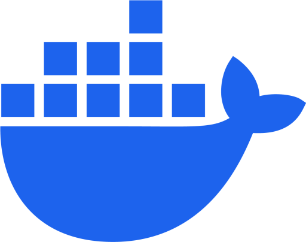

<p align="center">
  
</p>

<h1 align="center">DockerUpdates</h1>

<p align="center">
  A self-hosted web dashboard to manage the Docker containers of your server and keep them updated, Unraid style.
</p>

<p align="center">
  <a href="https://github.com/PixlGalaxy/DockerUpdates/actions/workflows/docker-image.yml"></a>
  <a href="LICENSE"></a>
  
</p>

---

## Features

- **Container overview**: state, image and tag, network, IP / MAC, ports (clickable), volumes, uptime, autostart
- **Live resources**: CPU and RAM refreshed every second, with the limits configured on each container (`--memory`, `--cpus`)
- **Update checks**: check one or all containers for new images and update them; private registries supported (GHCR, Docker Hub, any registry) using your `docker login`
- **Self-update**: DockerUpdates updates itself safely through a short-lived helper container
- **Edit containers like Unraid**: name, image, network, restart policy, ports, volumes, environment variables and **Extra parameters** (`--memory=2g --cpus=1.5 …`) validated as you type
- **Add containers** from any image
- **Bulk actions**: start / stop / pause / resume all (DockerUpdates never stops or pauses itself)
- **Icons**: custom icon URL per image, Unraid icon label, or the app's favicon discovered automatically
- **Secure by default**: login, revocable sessions, brute-force lockout, strict same-origin API, CSP and security headers, audit log ([SECURITY.md](SECURITY.md))
- Light / dark theme, search and filters, Linux and Windows (Docker Desktop) hosts

## Quick start

DockerUpdates runs as a container that talks to the host Docker daemon through its socket.

### 1. Create the configuration

```bash
mkdir -p ~/dockerupdates/data && cd ~/dockerupdates

cat > .env <<EOF
ADMIN_USER=admin
ADMIN_PASSWORD=$(openssl rand -base64 18)
SESSION_SECRET=$(openssl rand -hex 32)
HOST_IP=$(hostname -I | awk '{print $1}')
EOF
chmod 600 .env

cat .env   # note your generated password
```

### 2. Run it

**Docker CLI**

```bash
docker run -d --name dockerupdates --restart unless-stopped \
  --env-file ~/dockerupdates/.env \
  -p 3000:3000 \
  -v /var/run/docker.sock:/var/run/docker.sock \
  -v ~/.docker/config.json:/root/.docker/config.json:ro \
  -v ~/dockerupdates/data:/app/backend/data \
  --security-opt no-new-privileges \
  ghcr.io/pixlgalaxy/dockerupdates:latest
```

**Docker Compose**

```yaml
services:
  dockerupdates:
    image: ghcr.io/pixlgalaxy/dockerupdates:latest
    container_name: dockerupdates
    restart: unless-stopped
    env_file: .env
    ports:
      - "3000:3000"
    volumes:
      - /var/run/docker.sock:/var/run/docker.sock
      - ~/.docker/config.json:/root/.docker/config.json:ro   # optional: private registries
      - ./data:/app/backend/data                            # icons
    security_opt:
      - no-new-privileges:true
```

Open `http://<server-ip>:3000` and sign in.

> If `~/.docker/config.json` does not exist (you never ran `docker login`), remove that volume line.

## Configuration

All settings are environment variables (see [`backend/.env.example`](backend/.env.example)).

| Variable | Required | Default | Description |
| --- | :---: | --- | --- |
| `ADMIN_USER` | Yes | | Login username |
| `ADMIN_PASSWORD` | Yes | | Login password. Default or < 8 character passwords are rejected; use 12+ |
| `SESSION_SECRET` | | random | Signs session cookies, 32+ characters (`openssl rand -hex 32`) |
| `SESSION_HOURS` | | `12` | Maximum session lifetime |
| `SESSION_IDLE_MINUTES` | | `120` | Sign out after this much inactivity |
| `PORT` | | `3000` | HTTP port inside the container |
| `HOST_IP` | | auto | IP shown in the header and the *LAN IP:Port* links. Set it when running in Docker |
| `HOST_NAME` | | Docker host name | Server name shown in the header |
| `REGISTRY_AUTH` | | | Registry credentials, e.g. `ghcr.io=user:token,docker.io=user:token` |
| `TRUST_PROXY` | | private networks | IP of your reverse proxy (trusted for `X-Forwarded-*`) |
| `COOKIE_SECURE` | | `false` | `true` to always send the session cookie over HTTPS only |
| `ALLOWED_ORIGINS` | | | Extra origins allowed to call the API (normally not needed) |
| `DOCKER_HOST` / `DOCKER_SOCKET` | | platform socket | Custom Docker connection |

Changes to `.env` apply when the container is **recreated** (`docker rm -f` + `docker run`), not on `docker restart`.

## Private registries

To check and pull updates of private images, DockerUpdates needs registry credentials:

1. **Reuse your `docker login`** (recommended): run `docker login ghcr.io` on the host and mount `~/.docker/config.json` read-only, as in the quick start.
2. **Or** set `REGISTRY_AUTH=ghcr.io=<user>:<token>`. Use this if your login is stored in a credential helper (`"credsStore"` in `config.json`).

Use tokens with read-only scope (`read:packages` for GHCR). Containers whose registry rejects the pull show **Auth required** with a hint.

## Behind Nginx Proxy Manager

1. Create a *Proxy Host* pointing to `http://<server-ip>:3000`
2. SSL tab: request a certificate, enable **Force SSL**, **HTTP/2** and **HSTS**
3. Enable **Block Common Exploits** and, ideally, an **Access List** (IP allow-list or basic auth)
4. In `.env` add `TRUST_PROXY=<npm-ip>` and `COOKIE_SECURE=true`, then recreate the container
5. Do not forward port `3000` on your router, and do not add CORS headers in NPM

See the full [hardening checklist](SECURITY.md#hardening-checklist).

## Updating

- **From the app**: *Update* on the DockerUpdates row (or *Update all*). A helper container recreates it with the new image and the page reloads automatically.
- **Manually**:

  ```bash
  docker pull ghcr.io/pixlgalaxy/dockerupdates:latest
  docker rm -f dockerupdates
  # run the same `docker run` command again
  ```

## Development

Requirements: Node.js 22.9+ and a running Docker daemon.

```bash
# Backend (http://localhost:3000)
cd backend
cp .env.example .env      # set a strong ADMIN_PASSWORD
npm install
npm run dev

# Frontend (http://localhost:5173, proxies /api to the backend)
cd frontend
npm install
npm run dev
```

Build the image locally:

```bash
docker build --build-arg APP_VERSION=dev -t dockerupdates .
```

**Stack:** React 19 + TypeScript + Vite + Tailwind CSS 4 (frontend), Node.js + Express 5 + dockerode (backend). CI builds multi-arch images (`linux/amd64`, `linux/arm64`) and publishes them to GHCR; Dependabot keeps actions, npm packages and the base image updated.

## Security

DockerUpdates has full control over Docker on the host: treat access to it like root access. Read [SECURITY.md](SECURITY.md) for the security model, built-in protections and how to report a vulnerability privately.

## License

[MIT](LICENSE) © 2026 [PixlGalaxy](https://github.com/PixlGalaxy)

You can use, modify and redistribute DockerUpdates freely, as long as the copyright notice (the **DockerUpdates** name and its authors) and the license text are kept.
